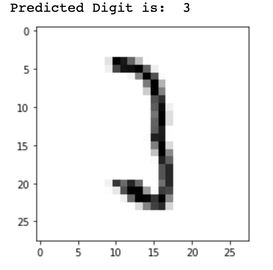
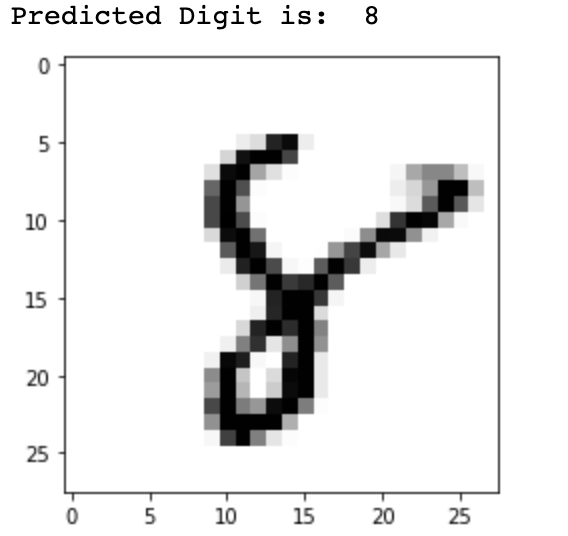
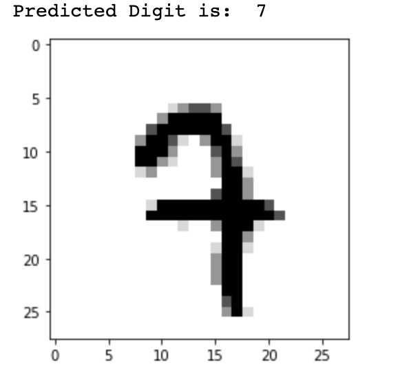

# Handwritten_Digit_Recognizer

Implemented a Convolutional Neural Network model using TensorFlow and Keras to predict digits from MNIST dataset of hand-written images. The model consists of Conv2D layers with max pooling and dropout layers for regularization to avoid overfitting. Optimized using adam, it achieved an accuracy of 98.58%.

## Model Demo

